# eCommerce Purchase Prediction Pipeline (Big Data & MLOps Infrastructure)

This repository contains a production-grade, containerized MLOps and Big Data analytics pipeline designed to process real-time clickstream events, predict customer purchasing behavior, and continuously retrain models on a distributed data lake.

The architecture seamlessly orchestrates distributed storage, high-throughput message streaming, stateful micro-batch aggregation, online machine learning inference, and an asynchronous operational web console.

---

## System Architecture & Data Lifecycle

The system operates using two distinct operational loops: a real-time predictive stream and an asynchronous batch-retraining lifecycle.

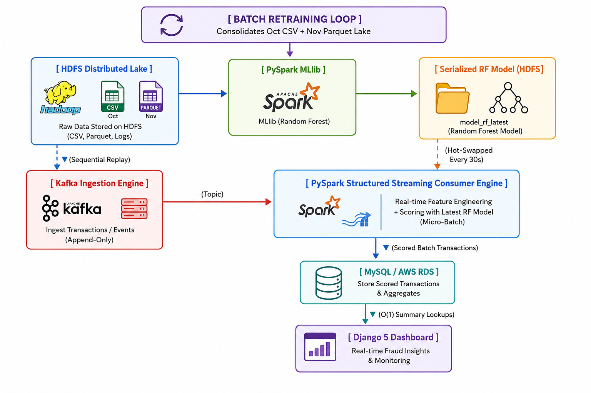

### 1. Storage & Messaging Layer

* **HDFS (Data Lake Cluster):** Houses raw input datasets (exceeding 1GB), column-oriented Parquet historical archives, serialized model binaries, and stateful streaming checkpoint files.
* **Apache Kafka (KRaft Mode):** Operates a zero-ZooKeeper message broker. The core streaming topic utilizes 3 distinct partitions to allow highly parallelized consumer access. Sessions are distributed via `user_session` hashing keys to ensure sequential execution for individual customer journeys.

### 2. Compute & ML Ingestion Layer

* **PySpark Structured Streaming Engine:** Consumes real-time JSON packets from Kafka. It tracks user sessions using an event-time `session_window` bounded by a 30-minute watermark. To comply with Spark’s dynamic window constraints, it processes streams in **Append Mode**, gracefully evicting inactive sessions from the state store to completely eliminate memory leaks.
* **PySpark MLlib Batch Pipeline:** Trains a session-level binary classifier. The algorithm is selected by the `MODEL_TYPE` environment variable — `logistic_regression` (default), `random_forest` (100 trees), or `gbt` — so the model actually in use is visible in configuration and in the run logs rather than fixed in code. Class imbalance is corrected automatically: `add_class_weights()` computes the negative-to-positive ratio from the training split at runtime and passes it as `weightCol`, so the correction tracks the data rather than a hardcoded constant.
* **Leakage control:** Session labels are derived from the full event list (did this window ever contain a purchase?), but every feature is aggregated with purchase events excluded. Including the purchase event in feature aggregation would make purchasing sessions mechanically longer, wider and differently priced, letting the model read the target off its own input.
* **Train/serve feature parity:** Both services group by `user_session` **and** a 30-minute `session_window`, and derive each feature with identical expressions. Grouping by session id alone in training would not be equivalent: a `user_session` in this dataset can persist across long idle gaps, so training would learn from one merged session while the streaming job — which needs `session_window` for state eviction under Append mode — scores two or three smaller ones. `tests/test_feature_parity.py` compares the grouping keys and the parsed aggregation expressions of both files and fails if either drifts.
* **Dynamic MLOps Orchestration:** Features a data-lake consolidator that uses a distributed `unionByName()` merge to aggregate historical training logs with the streaming Parquet lake. It re-scores the existing Champion against incoming Challengers using an apples-to-apples validation test matrix, executing zero-downtime memory model hot-swaps every 30 seconds.

### 3. Storage Sink & Analytical Dashboard

* **Pre-Aggregated Summary Pattern:** Avoids `COUNT(*)` table scans for the headline figures. The Spark engine writes prediction rows and increments the `running_metrics` counter table inside a single transaction, so a dashboard poll reads two integers rather than counting millions of rows.
* **Asynchronous Web Engine:** A read-only, dark-themed Django interface. Frontend JavaScript polls a `/api/stats/` JSON view every 8 seconds and updates **Chart.js** visuals in place, avoiding a full page reload. The counter reads are O(1) lookups against `running_metrics`; the per-minute trend chart is a `GROUP BY` bounded to a 30-minute window so it uses the `idx_scored_at` index instead of scanning the full `predictions` table on every poll.

---

## Repository Structure

```text
├── data/
│   └── raw/
│       ├── 2019-10/
│       │   └── 2019-Oct.csv                 # Raw historical dataset (>= 1GB training split)
│       └── 2019-11/
│           └── 2019-Nov.csv                 # Raw deployment dataset (>= 1GB streaming simulation)
├── django-dashboard/                        # Operational UI and Admin Console
│   ├── dashboard/                           # Django core settings configuration
│   │   ├── settings.py
│   │   ├── test_runner.py                   # Creates unmanaged tables in the test DB
│   │   └── urls.py
│   ├── monitor/                             # Analytical monitoring web application
│   │   ├── templates/monitor/index.html     # Real-time Chart.js dark-theme frontend
│   │   ├── models.py                        # Unmanaged mappings to streaming tables
│   │   ├── tests.py                         # Dashboard view and aggregation tests
│   │   └── views.py                         # Pre-aggregated polling endpoints
│   ├── Dockerfile
│   ├── manage.py
│   ├── requirements.txt
│   └── test_settings.py                     # SQLite overlay for running tests offline
├── ingestion-job/                           # High-speed data ingestion pipeline
│   ├── producer.py                          # WebHDFS stream-to-Kafka row relay script
│   ├── Dockerfile
│   └── requirements.txt
├── mysql-init/
│   └── init.sql                             # Database tables initialization schema
├── screenshots/                             # Evidence captures referenced throughout
│   ├── architecture.png                     # Formatted system workflow visual artifact
│   └── system_architecture.png              # Multi-tier cluster overview screenshot
├── scripts/
│   ├── create_kafka_topic.sh                # Stream topic partition mapping initialization
│   ├── clean_checkpoints.sh                 # Cleaning local Spark streaming checkpoints
│   ├── load_to_hdfs.sh                      # HDFS data lake bootstrapper utility
│   └── reset_and_run.sh                     # Full teardown + cold rerun, one command
├── tests/
│   └── test_feature_parity.py               # Train/stream feature contract tests
├── streaming-job/                           # Live stream scoring runtime
│   ├── consumer.py                          # Stateful PySpark Structured Streaming script
│   ├── Dockerfile
│   └── requirements.txt
├── training-job/                            # Automated batch model retraining module
│   ├── train.py                             # Polymorphic Champion/Challenger trainer script
│   ├── Dockerfile
│   └── requirements.txt
├── .env.example                             # Pipeline infrastructure environment setup template
├── .gitignore                               # Local compilation exclusions registry
├── README.md                                # Architectural overview document
├── docker-compose.yml                       # Distributed container runtime orchestrator
└── hadoop.env                               # Ecosystem cluster filesystem environmental variables

```

---

## Quick Start

Ensure your development environment contains Docker, Docker Compose, and a minimum of 8GB of free system RAM, then place the two Kaggle CSVs as described in step 1 below.

To tear down everything and run the whole pipeline cold in one command:

```bash
./scripts/reset_and_run.sh
```

It runs the test suites, verifies the working tree, removes all Docker volumes, rebuilds the images, brings each layer up in dependency order waiting on healthchecks, blocks until a Champion is registered, then starts ingestion and the dashboard. Source CSVs under `./data/raw` are never touched. Add `--yes` to skip the confirmation prompt, `--skip-tests` to go straight to the rebuild, or `--no-cache` to force a clean image build.

The remainder of this section walks the same sequence manually.

---

## Step-by-Step Deployment Guide

### 1. Initialize Configuration and Database Schema

1. **Clone the Repository**: Download the source code to your local machine by cloning the project repository.

   ```bash
   git clone https://github.com/Elthiero/auca-big-data-essential-final-exam.git
   cd auca-big-data-essential-final-exam
   ```

   *(Alternatively, you can manually download the [Project Source Code ZIP File](https://github.com/Elthiero/auca-big-data-essential-final-exam.git) and extract it.)*

2. Download the dataset files (`2019-Oct.csv` and `2019-Nov.csv`) directly from the [Kaggle eCommerce Behavior Data Dataset](https://www.kaggle.com/datasets/mkechinov/ecommerce-behavior-data-from-multi-category-store).
3. Unzip the downloaded archive.
4. Move and organize the unzipped `.csv` files into the project structure shown below:

    ```text
    ├── data/
    │   └── raw/
    │       ├── 2019-10/
    │       │   └── 2019-Oct.csv                 
    │       └── 2019-11/
    │           └── 2019-Nov.csv  
    ```

Generate your environment runtime profile and spin up your metadata storage block:

```bash
cp .env.example .env
docker compose up mysql -d
```

*you can modify the .env file.*

Verify that the unmanaged core tables (`model_registry`, `predictions`, and `running_metrics`) have initialized perfectly:

```bash
docker exec -it mysql mysql -u bigdata_user -p"$MYSQL_PASSWORD" \
  -e "USE model_registry; SHOW TABLES; SELECT * FROM running_metrics;"
```

*use the database user and password from your .env, if you are using AWS RDS or any other database you can check mysql-init/init.sql to get the sql queries.*

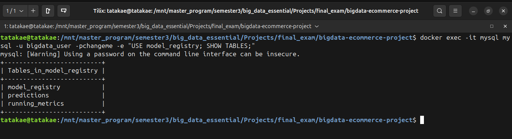

### 2. Bootstrap the HDFS Data Lake

Launch the distributed storage nodes:

```bash
docker compose up namenode datanode -d
docker compose ps          # wait until both say healthy
```

Access the NameNode web UI at `http://localhost:9870` to verify node health. Execute the bootstrapper script to automatically push your raw datasets into HDFS blocks:

```bash
./scripts/load_to_hdfs.sh
```

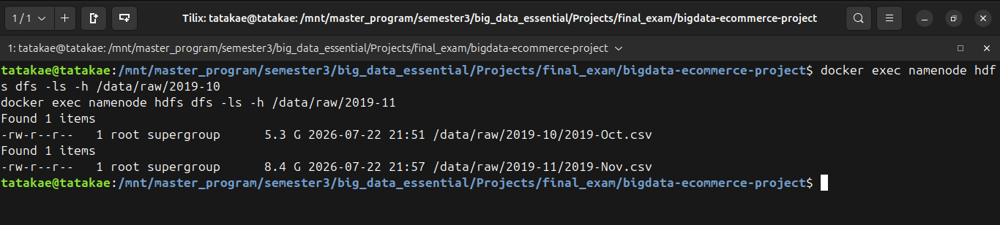

The raw CSVs are now split into HDFS blocks across the DataNode:

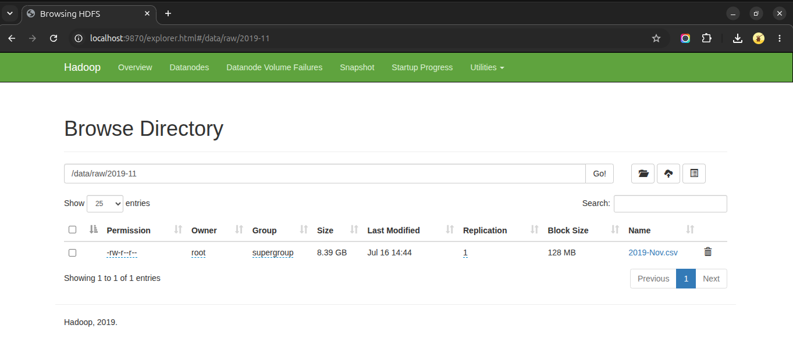
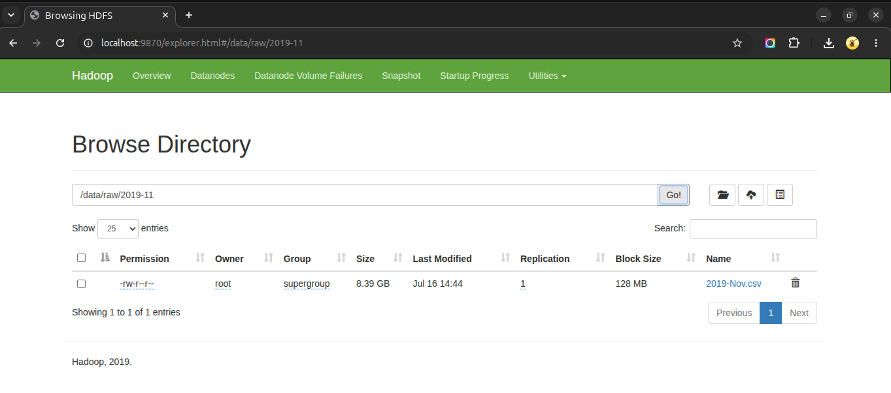

### 3. Spin Up Message Ingestion Network

Boot the self-managed Kafka communication node:

```bash
docker compose up kafka -d
docker compose ps          # wait for healthy
```

Initialize your event topic with 3 partitions to guarantee parallel streaming channels:

```bash
./scripts/create_kafka_topic.sh
```

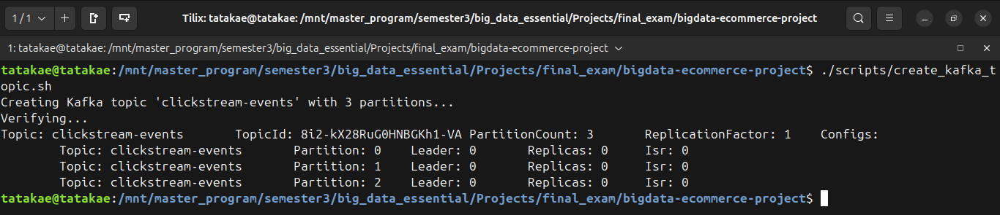

### 4. Execute the Initial Training Pass

Choose your classifier in `.env` if you want something other than the default (`logistic_regression` | `random_forest` | `gbt`):

```ini
MODEL_TYPE=logistic_regression
```

Kick off the batch machine learning process to establish your initial base model:

```bash
docker compose up training-job -d
```

To observe features being calculated, threshold sweeps executing, and weights generating, watch the logs:

```bash
docker logs -f training-job
```

To check model info from mysql, you can run:

```bash
docker exec -it mysql mysql -u bigdata_user -p"$MYSQL_PASSWORD" \
  -e "SELECT version, auc_score, decision_threshold, is_active FROM model_registry.model_registry;"
```

*Upon completion, the system saves your model directly inside HDFS at `/models/candidates/` and crowns it as `Champion v1` in the database.*

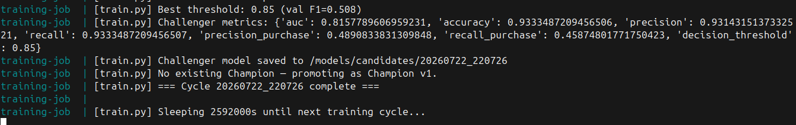

### 5. Launch Ingestion, Real-Time Inference, and the UI

Now that an active model is registered, ignite your live ingestion stream, PySpark consumer, and web dashboard simultaneously:

```bash
docker compose up streaming-job ingestion-job django-dashboard -d
```

Verify the real-time processing metrics using your container log tail:

```bash
docker logs -f streaming-job
```

Sink 1 of the streaming job simultaneously archives every incoming event to the Parquet data lake, partitioned by `event_type` and `event_date` — this is what the next retraining cycle consolidates with the October baseline:

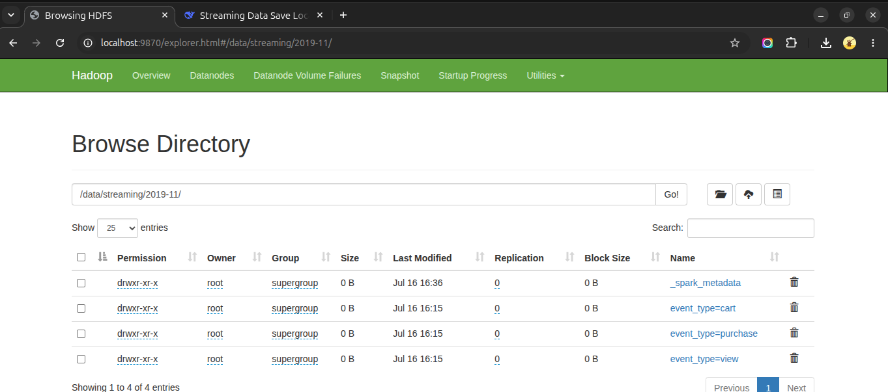

Open your web browser and navigate to `http://localhost:8000` to interact with your live operations monitoring engine.

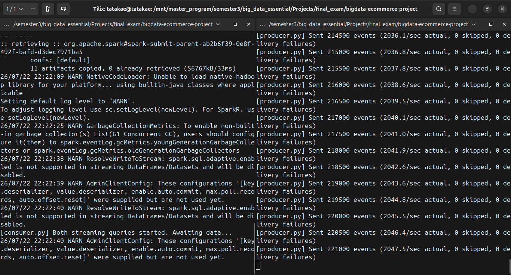

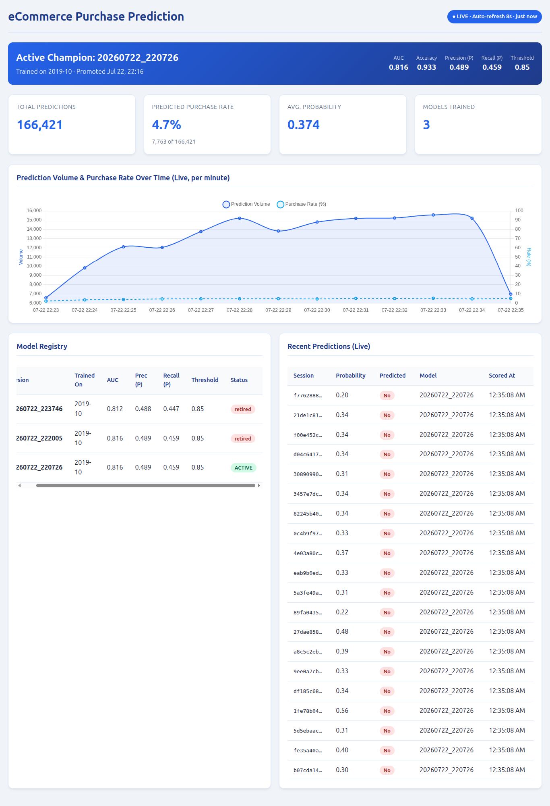

---

## Technologies and Version Information

| Layer | Technology | Version | Notes |
|---|---|---|---|
| Distributed storage | Apache Hadoop / HDFS | 3.2.1 | `bde2020/hadoop-*:2.0.0-hadoop3.2.1-java8`, replication factor 1, WebHDFS enabled |
| Message broker | Apache Kafka | 3.7.0 | `bitnamilegacy/kafka:3.7.0`, KRaft mode (no ZooKeeper), 3 partitions |
| Processing / ML | Apache Spark (PySpark) | 3.5.1 | `local[*]` mode inside each job container |
| Scala runtime | Scala | 2.12 | Determines the Kafka connector artifact suffix below |
| ML library | Spark MLlib | 3.5.1 | Ships with PySpark; no separate install |
| Database | MySQL | 8.0 | Local container, or AWS RDS MySQL — see migration section |
| Web framework | Django | 5.0.6 | Development server; read-only dashboard |
| Charting | Chart.js | 4.x (CDN) | Loaded client-side |
| Language runtime | Python | 3.10 | `python:3.10-slim` base for all four job images |
| Java runtime | OpenJDK JRE (headless) | 17 | `default-jre-headless`, Spark/JVM side only |
| Orchestration | Docker Compose | v2 | Single-host, six services |

### Dependencies

**Spark JAR resolved at runtime** (declared in `streaming-job/consumer.py` via `spark.jars.packages`, downloaded on first run and cached in the `spark_ivy_cache` volume):

```text
org.apache.spark:spark-sql-kafka-0-10_2.12:3.5.1
```

The `_2.12` suffix must match the Scala version Spark was built against, and the trailing `3.5.1` must match the PySpark version in `requirements.txt`. A mismatch in either produces a `ClassNotFoundException` for the Kafka source at query start rather than at import time, which makes it easy to misdiagnose.

**Python packages by service:**

| Service | Packages |
|---|---|
| `ingestion-job` | `hdfs==2.7.3`, `confluent-kafka==2.5.0`, `requests==2.31.0` |
| `streaming-job` | `pyspark==3.5.1`, `pymysql==1.1.0`, `cryptography==42.0.8`, `numpy==1.26.4`, `pandas==2.1.1` |
| `training-job` | `pyspark==3.5.1`, `pymysql==1.1.0`, `cryptography==42.0.8`, `numpy==1.26.4`, `pandas==2.1.1` |
| `django-dashboard` | `Django==5.0.6`, `PyMySQL==1.1.0`, `cryptography==42.0.8` |

Two deliberate substitutions: `confluent-kafka` over `kafka-python`, because delivery failures surface through its callback instead of being retried silently in a background thread; and `PyMySQL` over `mysqlclient`, because it is pure Python and avoids adding `libmysqlclient-dev` plus a C toolchain to the images.

---

## Testing

```bash
# Cross-service contract tests — no pyspark, JVM, HDFS or MySQL required
python -m pytest tests/ -v

# Dashboard tests (SQLite, no running MySQL required)
cd django-dashboard && python manage.py test monitor --settings=test_settings
```

`tests/test_feature_parity.py` guards the pipeline's most dangerous failure mode, which is silent. `streaming-job` loads a `PipelineModel` that `training-job` fit against a specific *ordered* feature list, produced by specific aggregation expressions over a specific grouping key. Of the three ways those can drift, only one announces itself: a **missing** column raises at runtime, but a **reordered** column list, a **changed grouping key**, and a **changed aggregation expression** all fail silently — Spark scores every session against a distribution the model never saw and returns confident nonsense with no error anywhere.

The tests parse both source files with `ast` and compare the grouping keys and the per-alias aggregation expressions structurally. They were mutation-checked: reordering `FEATURE_COLS`, replacing the session-window grouping with a plain `groupBy("user_session")`, and dropping the purchase exclusion from a single price aggregate each produce a failure.

The dashboard tests cover the empty-database path (the frontend polls `/api/stats/` from page load, before any prediction exists), the pre-aggregated counter reads, and the trend window.

---

## Core Performance Metrics

> **Regenerate before submitting.** The figures below must come from your own run. Earlier numbers in this README predated the leakage fix described above and are not comparable — features were being aggregated over purchase events, which inflated every score. Run `docker compose up training-job -d && docker logs -f training-job` and copy the reported values in.

### Batch training (`training-job`)

| Metric | Value |
|---|---|
| Classifier (`MODEL_TYPE`) | _fill in_ |
| Sessions after aggregation | _fill in_ |
| Purchase rate (positive class) | _fill in_ |
| Class weight ratio (neg/pos, computed at runtime) | _fill in_ |
| Best decision threshold (validation $F_1$) | _fill in_ |
| Test AUC | _fill in_ |
| Test accuracy | _fill in_ |
| Precision / recall on the purchase class | _fill in_ |

Note that accuracy is close to meaningless on this problem — a model that predicts "no purchase" for every session scores well above 90% — which is why promotion decisions in `train.py` are made on AUC and why `precision_purchase` / `recall_purchase` are tracked separately from their weighted counterparts.

Split strategy is chronological, not random: 60% train / 15% validation / 25% test by `session_start`. A random split would let the model learn from sessions that occur *after* the ones it is evaluated on, which does not correspond to any real deployment.

### Stream scoring (`streaming-job`)

* **Intake rate-limiting:** `maxOffsetsPerTrigger=30000` caps how much backlog a single trigger absorbs, keeping micro-batch memory bounded when the consumer starts from `earliest` against an already-full topic.
* **Write batching:** Prediction rows are inserted with `executemany` in chunks of 5,000 inside one transaction per partition, which also increments the `running_metrics` counters atomically.
* **Emission semantics:** Append mode over a `session_window` emits one scored row per session, once the 30-minute watermark closes it. Sessions still open when the producer stops will not be emitted.

### Findings

> Fill this in from your own run — this is the section the rubric asks for, and it is the one graders read for evidence of thinking rather than plumbing. State conclusions about the *business problem*, not the infrastructure. Prompts to answer from your dashboard and training logs:

* Which features carry the most signal? For logistic regression, inspect `model.stages[-1].coefficients` against `FEATURE_COLS`; for the tree models, `featureImportances`. The expectation is that `has_cart` and `cart_count` dominate — quantify by how much.
* What is the operating trade-off at your chosen threshold? At threshold *t* you catch X% of real purchasers while Y% of flagged sessions never convert. Translate that into a decision: at what precision does it become worth triggering a discount offer or a retargeting email?
* How does purchase rate vary across the live stream? The per-minute trend chart shows this directly.
* Did the Challenger beat the Champion after retraining on Oct+Nov, and by how much AUC? If it did not clear the 0.02 promotion threshold, that is a legitimate finding — it says the October model already generalized to November — not a failure.
* What are the limits? Single-node HDFS with replication 1, one Kafka broker, Spark in `local[*]`, and a replayed historical file standing in for genuine real-time traffic. Naming these is a stronger finish than claiming production readiness.

---

## Multi-Tier Cluster Overview

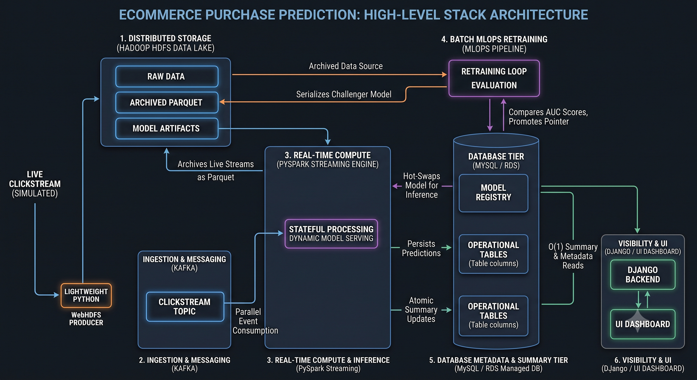

---

## Cloud Strategy: AWS RDS Migration

Follow this production blueprint to shift your data tier to an AWS cloud-managed system:

1. **Deploy Instance:** Launch an AWS RDS instance using the engine type **MySQL Community Edition** under the AWS Free Tier. Set the inbound VPC Security Group Rules to accept active TCP traffic on port `3306` from your host gateway IP.
2. **Import Schema:** Connect your database administration workspace (e.g., DBeaver or MySQL Workbench) to your AWS RDS Endpoint and run the initialization script located in `mysql-init/init.sql`.
3. **Re-route Credentials:** Open your project `.env` file and replace local variables with your cloud database instance location coordinates:

    ```ini
    MYSQL_HOST=your-instance-id.cluster-hash.us-east-1.rds.amazonaws.com
    MYSQL_DATABASE=model_registry
    MYSQL_USER=your_aws_rds_username
    MYSQL_PASSWORD=your_aws_rds_secure_password
    ```

4. **Optimize Resource Limits:** Open your `docker-compose.yml` file and completely remove or comment out the `mysql` service container block. This frees up valuable RAM and local CPU allocation cycles. Run `docker compose up -d` to resume system functions over your cloud data storage tier.
